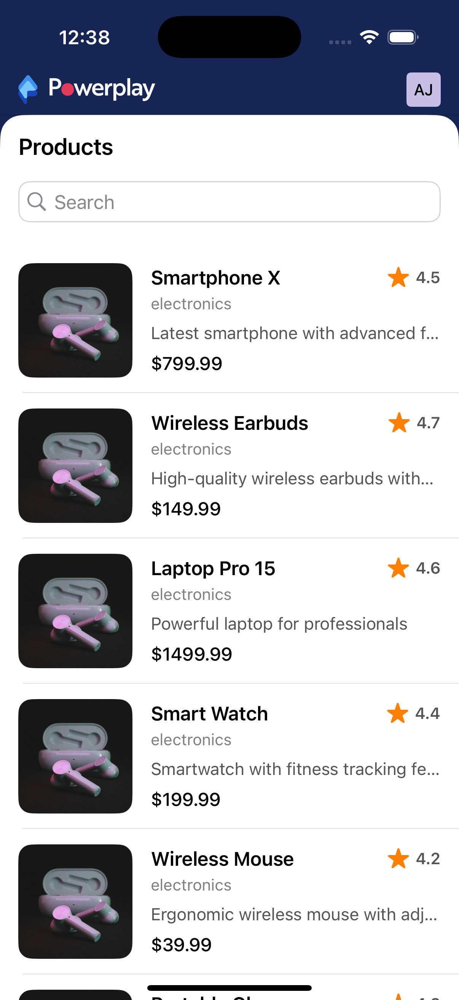
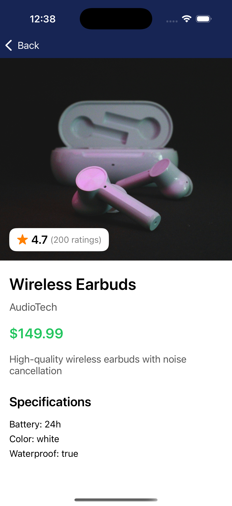

# PowerPlay Products

An iOS application that displays a paginated list of products from a remote API. The app is built with UIKit and follows the MVVM architectural pattern.

## Objective

The primary objective of this project is to build a functional iOS application that demonstrates proficiency in the following areas:
-   **Networking:** Fetching data from a paginated API using `NSURLSession`.
-   **Data Parsing:** Parsing JSON responses with `Codable`.
-   **UI Development:** Building a responsive and user-friendly UI with `UIKit`, including a `UITableView` with custom cells.
-   **Architecture:** Implementing a clean and scalable architecture (MVVM).
-   **Error Handling:** Gracefully handling network errors and empty states.

## Features

-   **Paginated Product List:** Displays a list of products from a remote API with support for infinite scrolling.
-   **Product Detail View:** Allows users to tap on a product to view its full details.
-   **MVVM Architecture:** The project is structured using the Model-View-ViewModel (MVVM) pattern to ensure a clean separation of concerns.
-   **Lazy Image Loading:** Images are loaded asynchronously to ensure a smooth scrolling experience.
-   **Error Handling:** The app gracefully handles network errors and displays a dedicated error screen with a retry option.
-   **Loading and Empty States:** The UI provides clear feedback to the user with loading indicators and empty state views.

## Architecture

The application is built using the **Model-View-ViewModel (MVVM)** architectural pattern. This pattern helps to separate the UI (View) from the business logic (ViewModel) and the data (Model).

-   **Model:** Represents the data and business logic of the application. In this project, the models are `Product`, `APIResponse`, etc.
-   **View:** The UI of the application. This includes the `ProductListViewController`, `ProductDetailViewController`, and `ProductTableViewCell`.
-   **ViewModel:** Acts as a bridge between the Model and the View. It is responsible for fetching and preparing the data to be displayed by the View.

## Screenshots

| Product List | Product Detail |
| :----------: | :------------: |
|     |       |

## Getting Started

To get a local copy up and running, follow these simple steps.

### Prerequisites

-   Xcode 13 or later
-   iOS 15.0 or later

### Installation

1.  Clone the repo
    ```sh
    git clone https://github.com/jhaaryan597/PowerPlay-Products.git
    ```
2.  Open the project in Xcode
    ```sh
    open PowerPlay.xcodeproj
    ```
3.  Run the project on a simulator or a physical device.

